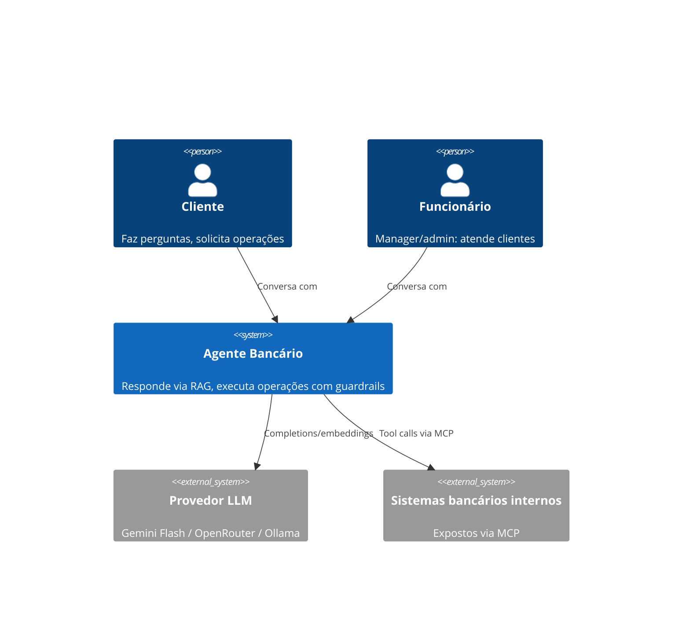
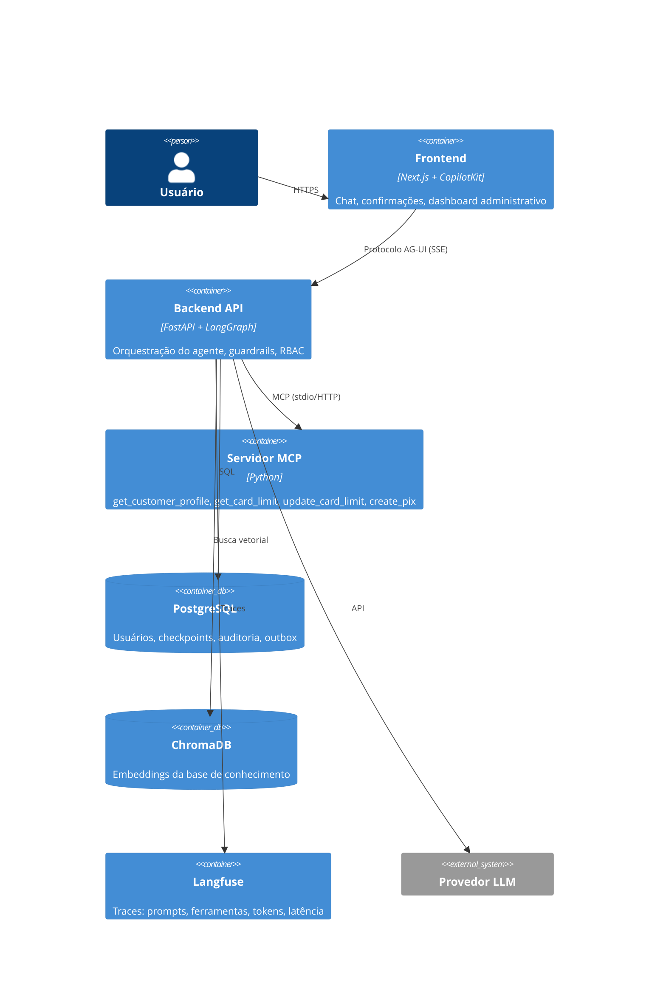
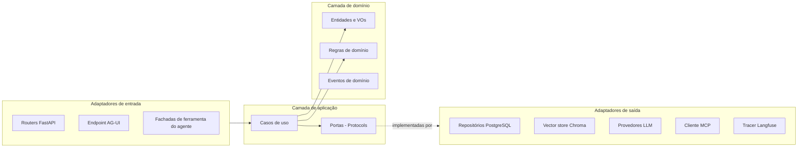
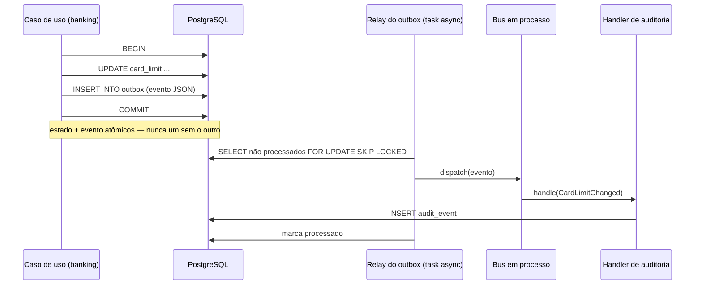

# Arquitetura

Visão executiva da arquitetura do sistema. O contexto de produto e o "como executar" estão no [README.md](README.md).

## Princípios

1. **Monolito modular** — um único deployável com módulos internos de fronteiras estritas. Microserviços não se justificam neste escopo; as fronteiras entre módulos (verificadas por import-linter no CI) mantêm barata uma extração futura.
2. **Hexagonal (ports & adapters)** — a lógica de domínio nunca importa frameworks, SDKs de LLM ou drivers. Tudo que é volátil (provedor de LLM, vector store, transporte MCP, banco de dados) fica atrás de uma porta.
3. **Event-driven com outbox transacional** — eventos de domínio (ex.: `PixTransferExecuted`) são gravados no PostgreSQL na mesma transação da mudança de estado e depois despachados para handlers em processo (auditoria, notificações). Nenhum evento se perde; nenhum broker é necessário.
4. **Segurança determinística, linguagem probabilística** — o LLM decide *o que o usuário quer*; código puro decide *se ele pode*. Autorização, validação de limites e gates de confirmação são impostos pela camada de autorização, nunca por prompts.
5. **DDD-lite** — entidades, objetos de valor, eventos de domínio e linguagem ubíqua, sem a cerimônia tática completa.

## Bounded contexts

| Módulo | Responsabilidade | Agregados principais |
|---|---|---|
| `identity_access` | Autenticação (JWT), RBAC, autenticação step-up | User, Role, Session |
| `conversation` | Sessões de chat, estado/checkpoints do LangGraph, resolução de contexto | Conversation |
| `knowledge` | RAG: ingestão, recuperação, citação | KnowledgeDocument, Chunk |
| `banking` | Limites de cartão, PIX, regras de elegibilidade, cliente MCP | Card, PixTransfer |
| `audit` | Trilha de auditoria imutável, consome eventos de domínio | AuditEvent |

Os cinco módulos não podem importar internals uns dos outros (contrato de independência no import-linter).

## C4 — Nível 1 (contexto de sistema)

## C4 — Nível 2 (containers)

## Anatomia de um módulo (hexagonal)

**Regra de dependência:** as dependências de código apontam só para dentro. `domain` não conhece nada; `application` conhece `domain`; `adapters` conhecem `application` + `domain`; a fiação acontece na raiz de composição (container de DI em `shared`).

### Catálogo de portas (principais)

Portas são `Protocol` do Python definidas em `application/ports/` de cada módulo:

| Módulo | Porta | Propósito | Adaptador(es) |
|---|---|---|---|
| `identity_access` | `UserRepository` / `TokenService` / `StepUpService` | usuários e papéis / JWT / códigos step-up de uso único | PostgreSQL, PyJWT |
| `conversation` | `LlmPort` | chat completion + saída estruturada | Gemini, OpenRouter, Ollama (+ cadeia de fallback) |
| `conversation` | `CheckpointStore` | persistir estado do LangGraph | langgraph-checkpoint-postgres |
| `knowledge` | `EmbeddingPort` / `VectorStorePort` / `DocumentLoaderPort` | embeddings / busca com filtros de metadados / parse de PDF-MD-TXT | Gemini ou Ollama, ChromaDB, loaders LangChain |
| `banking` | `BankingSystemsPort` | perfil, limites, execução de PIX — **único caminho até os sistemas bancários** | adaptador cliente MCP |
| `banking` | `PendingOperationRepository` | confirmações pendentes | PostgreSQL |
| `audit` | `AuditLogRepository` | append + consulta de eventos de auditoria | PostgreSQL (insert-only) |
| `shared` | `EventPublisher` / `TracerPort` / `Clock` | publicar eventos de domínio / spans e generations / tempo testável | escritor de outbox (mesma transação), Langfuse ou no-op |

Regras práticas: uma porta por volatilidade (não por classe); portas falam a linguagem do domínio (nenhum formato de payload MCP vaza para dentro); adaptadores são burros — só tradução e I/O, decisão em adaptador é bug.

## Eventos — outbox transacional

- **Escrita:** a porta `EventPublisher` grava o evento na tabela `outbox` dentro da transação do caso de uso.
- **Relay:** uma task asyncio de fundo faz poll do outbox (`FOR UPDATE SKIP LOCKED`), despacha para o bus e marca as linhas. Crash entre despacho e marcação → reentrega → **handlers são idempotentes** (dedupe por `event_id`).
- **Entrega at-least-once**; falhas repetidas viram linha de dead-letter.
- Todos os eventos estendem `DomainEvent` (`event_id`, `occurred_at`, `actor_user_id`, `trace_id`, `version`); nomes no passado, prefixados pelo módulo (`banking.PixTransferExecuted`, `identity.AuthorizationDenied`, `conversation.GuardrailTriggered`...). Payloads carregam PII sempre mascarada; handlers nunca chamam o LLM.
- **Evolução:** se um módulo sair do monolito, o outbox permanece — só o despacho em processo é trocado por um publisher de broker dentro do relay. Produtores não mudam. Essa é a razão de escolher outbox em vez de "chamar a auditoria sincronamente".

## Ciclo de vida da requisição (caminho feliz, operação bancária)

1. O frontend transmite a mensagem do usuário via AG-UI para o FastAPI.
2. **Guardrails de entrada:** triagem de injeção de prompt, filtro de escopo, detecção de PII.
3. O **agente LangGraph** resolve referências conversacionais a partir do estado checkpointado e roteia a intenção (pergunta RAG vs operação bancária).
4. A **camada de autorização** verifica a matriz RBAC + propriedade do recurso *antes* de qualquer ferramenta executar.
5. A chamada de ferramenta passa pelo **adaptador cliente MCP** até o servidor MCP.
6. Operações críticas caem num `interrupt()` do LangGraph — a execução pausa até o usuário confirmar (e, para PIX, autenticar via step-up).
7. Mudança de estado + evento de domínio são gravados atomicamente (outbox); o handler de auditoria persiste o registro.
8. **Guardrails de saída:** verificação de grounding, citação obrigatória, mascaramento de PII. A resposta só é transmitida após aprovação — texto já enviado não pode ser des-mascarado.
9. O trace completo (prompts, ferramentas, tokens, latência, `trace_id` correlacionado aos logs e à auditoria) chega ao Langfuse.

## Principais trade-offs

| Decisão | Escolha | Rejeitado | Por quê |
|---|---|---|---|
| Formato de deploy | Monolito modular | Microserviços | Escopo, tamanho de time, latência; fronteiras preservadas para extração |
| Eventos | Outbox + bus em processo | Kafka/RabbitMQ | Durabilidade sem o custo operacional de um broker |
| Sistema de registro | PostgreSQL | MongoDB, SQLite | ACID para estado + outbox + auditoria + checkpoints num só banco |
| Vector store | ChromaDB | FAISS, OpenSearch, pgvector | Persistente, dockerizado, filtros de metadados; FAISS sem modo servidor, OpenSearch pesado |
| Orquestração | LangGraph | Loop manual, CrewAI, AutoGen | Checkpointing, `interrupt()` para human-in-the-loop, grafo determinístico |
| Estratégia de LLM | Porta de provedor com fallback (Gemini → OpenRouter → Ollama) | Provedor único fixo | Resiliência a quota; perfil 100% local |
| Acesso a sistemas internos | Servidor MCP + adaptador cliente | REST direto, function-calling em processo | Fronteira explícita e auditável entre agente e core bancário |
| Autorização | Camada em código | Regras via prompt | O LLM nunca pode ser a fronteira de segurança |
| Observabilidade | Langfuse self-hosted + logs JSON | LangSmith, só OpenTelemetry | Traces de LLM com UI própria, rodando local |
| Dinheiro | `Decimal`, centavos inteiros nas bordas | float | Precisão monetária inegociável |
